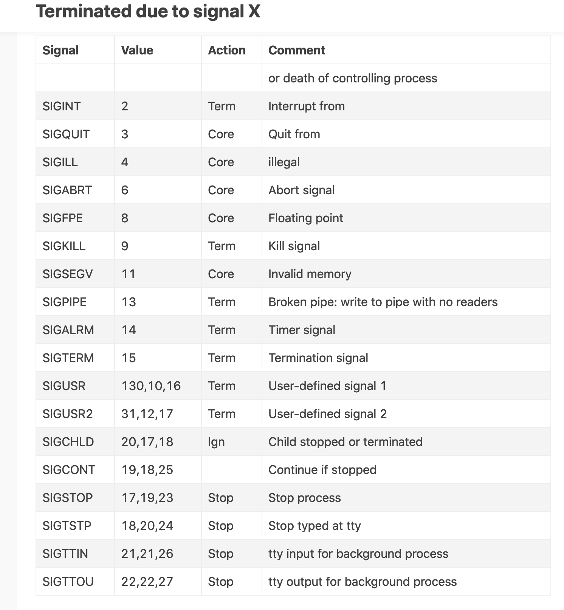
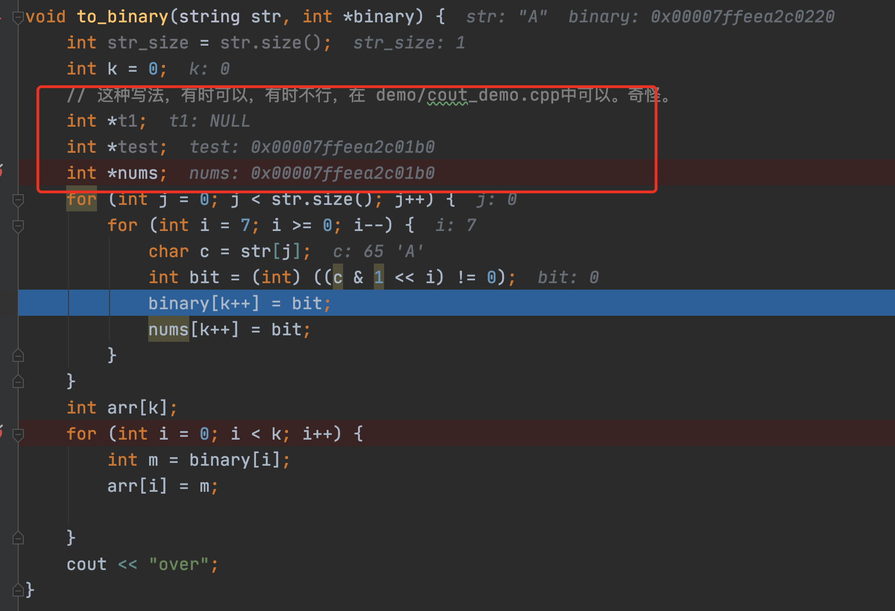

##20200507
###接收get请求

1.`no known conversion from 'void (int)' to 'void * _Nullable (* _Nonnull)(void * _Nullable)' for 3rd argument`

原因就是C语言编译器允许隐含性的将一个通用指针转换为任意类型的指针，包括const *而C＋＋不允许将const 转换为非const*，所以出错。

所以要按照符合函数声明的本来面目修改出错函数的形参输入与返回值

https://blog.csdn.net/searchwang/article/details/30036129

```
int pthread_create(pthread_t _Nullable * _Nonnull __restrict,
		const pthread_attr_t * _Nullable __restrict,
		void * _Nullable (* _Nonnull)(void * _Nullable),
		void * _Nullable __restrict);
```
warning: cast to 'void *' from smaller integer type 'int' [-Wint-to-void-pointer-cast]

把

```
if (pthread_create(&newthread, NULL, accept_request, (void *) client_sock) != 0) {
    perror("pthread_create");
}
```

改成

```
void *tmp = (void *) (long)client_sock;
if (pthread_create(&newthread, NULL, accept_request, tmp) != 0) {
    perror("pthread_create");
}
```

原因未知。

2.读取图片，读取的数据残缺，原因未知。耗时许久。

调试非常低效。

图片不能显示，浏览器一直处于加载状态=======>Content-Length大于发送给浏览器的数据大小。

`ifstream` 读取的图片文件数据大小，小于图片文件实际大小。

读取图片文件，是否使用循环。不使用循环，只能读取到一部分数据。

使用循环后，读取到的数据总是小于实际数据。

在使用循环和不使用循环上面调试好久。

又在是否使用二进制模式读取数据这个方向耗时许久。

最后，再次搜索*c++读取数据*，尝试一个例子后，解决了问题。

一个c++用法，耗时五六个小时，太低效了。

每次调试，要拟好思路，每个思路，只需验证两三次，就排除。无脑重复，实在不可取。

解决了。需要正确地读取图片文件。错误原因，读取的图片文件数据丢失，与实际文件大小不一致，导致Content-Length大于向浏览器返回的数据。

正确读取图片文件的代码：

```
PICTURE read_picture(string file_path) {
    string data;
    using namespace std;
    ifstream is(file_path, ios::in);
//    ifstream is(file_path, ios::in | ios::binary);  // ok
    // 2. 计算图片长度
    is.seekg(0, is.end);
    int len = is.tellg();
    is.seekg(0, ios::beg);
    stringstream buffer;
    buffer << is.rdbuf();
    PICTURE picture = {len, len, buffer.str()};
    // 到此，图片已经成功的被读取到内存（buffer）中
    return picture;
}
```

3.显示图片的网页不能正常显示

```
<!--<p>显示图片</p>-->

```

图片网络请求一直处于 pending 状态。

解决：建立的tcp连接数量，导致整个问题。

包含图片的网页A，发起三个http请求，一个是请求网页本身，一个是请求favicon.ion，另一个是请求图片。前两个请求正常，第三个请求一直是`pending`状态。

修改`Connection`，值为`keep-alive`或'close`，都不起作用。

关闭发送`http`数据的`tcp socket`后，初次打开网页A，正常。再次打开任何网页，已经不能连接到`http`服务器。

在关闭`socket`前，休眠一小会儿，竟然正常了。

这种方法，一定存在很大的瓶颈，并发量不会很高。

想方设法提高`http`服务器的处理速度，这种方法却需要休眠一段时间。

有更好的方法吗？

找到这个方法，纯粹是突发奇想地猜想。

我怀疑过是浏览器的问题，很快排除这中可能。

怀疑过是`http`协议中的响应行中的`Connection`的问题，测试后排除这种可能。

开始怀疑服务端`socket`监听数量的问题，`listen`的第二个参数，排除。

怀疑服务端`pthread_create`创建线程的数量有限制，排除。

我实现的这个方法，一个tcp只能处理一个http事务，`Connection:keep-alive`并没有实现，不是真正的`http/1.1`。

4.从`socket`读取实体主体数据卡住

```
string read_body(int socket_fd) {
    std::cout << "start read body" << std::endl;
    string body;
//    char data[1024];
    char c;
    while (recv(socket_fd, &c, 1, 0) != -1) {
        body += c;
    }
    std::cout << body;

//    while (recv(socket_fd, data, sizeof(data), 0) != -1) {
//        std::cout << data;
//        body += data;
//    }

    return body;
}
```

并非完全卡住，而是在读取完所有实体主体数据后，`recv`卡住，持续数秒后，进程退出。

接收不到数据了，为什么不主动退出循环而是卡住等待客户端发送数据呢？

之前打日志时出错，使我对该段代码的执行状况有错误的理解。

卡住一段时间后，进程意外退出，`Process finished with exit code 11`。

对比`Content-Length`值与实际接收到的数据的大小比较，若两者相等，主动退出循环。

5.停止服务器后马上启动，为什么无法提供`http`服务？

10多秒后再启动服务器，就正常了。

6.用浏览器提交一次表单，POST请求，却产生三次POST请求

这是为什么？

使用postman提交请求，只产生一次POST请求。

服务端逐个字符接收客户端数据，没有问题。一次性接收多个字符，也没有问题。

逐个接收字符

```
char c;
while (recv(socket_fd, &c, 1, 0) != -1) {
    body += c;
    if (body.size() == content_length) {
        break;
    }
}
```

一次性接收多个字符

```
string body;
char data[1024];
while (recv(socket_fd, data, sizeof(char)*1024, 0) != -1) {
    body += data;
    if (body.size() == content_length) {
        break;
    }
}
```

7.接收上传文件的表单提交的数据

数据

```
POST /server.html HTTP/1.1
Host: 127.0.0.1
Connection: keep-alive
Content-Length: 291042
Pragma: no-cache
Cache-Control: no-cache
Upgrade-Insecure-Requests: 1
Origin: http://127.0.0.1
Content-Type: multipart/form-data; boundary=----WebKitFormBoundaryPL3JKVDDvW4BBCCH
User-Agent: Mozilla/5.0 (Macintosh; Intel Mac OS X 10_15_1) AppleWebKit/537.36 (KHTML, like Gecko) Chrome/81.0.4044.129 Safari/537.36
Accept: text/html,application/xhtml+xml,application/xml;q=0.9,image/webp,image/apng,*/*;q=0.8,application/signed-exchange;v=b3;q=0.9
Sec-Fetch-Site: same-origin
Sec-Fetch-Mode: navigate
Sec-Fetch-User: ?1
Sec-Fetch-Dest: document
Referer: http://127.0.0.1/form.html
Accept-Encoding: gzip, deflate, br
Accept-Language: zh-CN,zh;q=0.9,en-US;q=0.8,en;q=0.7,ja;q=0.6
------WebKitFormBoundaryPL3JKVDDvW4BBCCH
Content-Disposition: form-data; name="title"

穿越时空的恋爱
------WebKitFormBoundaryPL3JKVDDvW4BBCCH
Content-Disposition: form-data; name="age"

彻底撒富家大室发的说法
------WebKitFormBoundaryPL3JKVDDvW4BBCCH
Content-Disposition: form-data; name="pic"; filename="9-1602061H626.jpg"
Content-Type: image/jpeg

<图片数据，一段乱码>
------WebKitFormBoundaryPL3JKVDDvW4BBCCH--
```

神奇，实体主体与请求行之间的分隔符不是`\r\n`。不是这样的。在服务端，我没有输出换行符。

表单

```
<!DOCTYPE html>
<html lang="en">
<head>
    <meta charset="UTF-8">
    <title>表单</title>
</head>
<body>
<form action="./server.html" method="post">
    <p><input type="text" name="title"></p>
    <p><input type="text" name="age"></p>
<!--    <p><input type="file" name="pic"></p>-->
    <p><input type="submit"></p>
</form>

</body>
</html>
```

服务端接收到的数据

```
POST /server.html HTTP/1.1
Host: 127.0.0.1
Connection: keep-alive
Content-Length: 173
Pragma: no-cache
Cache-Control: no-cache
Upgrade-Insecure-Requests: 1
Origin: http://127.0.0.1
Content-Type: application/x-www-form-urlencoded
User-Agent: Mozilla/5.0 (Macintosh; Intel Mac OS X 10_15_1) AppleWebKit/537.36 (KHTML, like Gecko) Chrome/81.0.4044.129 Safari/537.36
Accept: text/html,application/xhtml+xml,application/xml;q=0.9,image/webp,image/apng,*/*;q=0.8,application/signed-exchange;v=b3;q=0.9
Sec-Fetch-Site: same-origin
Sec-Fetch-Mode: navigate
Sec-Fetch-User: ?1
Sec-Fetch-Dest: document
Referer: http://127.0.0.1/form.html
Accept-Encoding: gzip, deflate, br
Accept-Language: zh-CN,zh;q=0.9,en-US;q=0.8,en;q=0.7,ja;q=0.6

title=%E7%A9%BF%E8%B6%8A%E6%97%B6%E7%A9%BA%E7%9A%84%E6%81%8B%E7%88%B1&age=%E5%BD%BB%E5%BA%95%E6%92%92%E5%AF%8C%E5%AE%B6%E5%A4%A7%E5%AE%A4%E5%8F%91%E7%9A%84%E8%AF%B4%E6%B3%95
```

表单

```
<!DOCTYPE html>
<html lang="en">
<head>
    <meta charset="UTF-8">
    <title>表单</title>
</head>
<body>
<form action="./server.html" method="post" enctype="multipart/form-data">
    <p><input type="text" name="title"></p>
    <p><input type="text" name="age"></p>
<!--    <p><input type="file" name="pic"></p>-->
    <p><input type="submit"></p>
</form>

</body>
</html>
```

服务端接收到的数据

```
POST /server.html HTTP/1.1
Host: 127.0.0.1
Connection: keep-alive
Content-Length: 280
Pragma: no-cache
Cache-Control: no-cache
Upgrade-Insecure-Requests: 1
Origin: http://127.0.0.1
Content-Type: multipart/form-data; boundary=----WebKitFormBoundaryn8OE4vY8st2mRIJC
User-Agent: Mozilla/5.0 (Macintosh; Intel Mac OS X 10_15_1) AppleWebKit/537.36 (KHTML, like Gecko) Chrome/81.0.4044.129 Safari/537.36
Accept: text/html,application/xhtml+xml,application/xml;q=0.9,image/webp,image/apng,*/*;q=0.8,application/signed-exchange;v=b3;q=0.9
Sec-Fetch-Site: same-origin
Sec-Fetch-Mode: navigate
Sec-Fetch-User: ?1
Sec-Fetch-Dest: document
Referer: http://127.0.0.1/form.html
Accept-Encoding: gzip, deflate, br
Accept-Language: zh-CN,zh;q=0.9,en-US;q=0.8,en;q=0.7,ja;q=0.6

------WebKitFormBoundaryn8OE4vY8st2mRIJC
Content-Disposition: form-data; name="title"

穿越时空的恋爱
------WebKitFormBoundaryn8OE4vY8st2mRIJC
Content-Disposition: form-data; name="age"

彻底撒富家大室发的说法
------WebKitFormBoundaryn8OE4vY8st2mRIJC--
==============================body start=====================
------WebKitFormBoundaryn8OE4vY8st2mRIJC
Content-Disposition: form-data; name="title"

穿越时空的恋爱
------WebKitFormBoundaryn8OE4vY8st2mRIJC
Content-Disposition: form-data; name="age"

彻底撒富家大室发的说法
------WebKitFormBoundaryn8OE4vY8st2mRIJC--

==============================body end=====================

```

不解析POST请求数据，而是将这些数据转发给php等处理。

## 实现fpm协议
就是把动态请求转发给php。

半年前实现过fpm协议，现在，忘记了百分之九十五。我不相信，理解了东西，就不会忘记，下次做就很容易。自己几个月前写的东西，时间久了，再次接触，有时看不懂。

一定要做好笔记，不要相信记忆力。

需要把请求行在内的所有数据转发给php，另外，需要传递数个从请求行内才能获取的数据。

工作量主要在实现fpm协议，对照着原来的java代码翻译。

### 实现
#### 回忆
建立连接到php的tcp连接。将数据传递给php，然后从php读取结果A。A就是http服务器需要的结果。

传递给php的数据是一个数据包，构成：请求开始，请求参数，请求参数结束符，请求数据主体，请求结束标志符。

以上是我看半年前的java代码实现后回忆内容。后面，我会根据java代码写出完全符合代码的文档。
#### 实际实现
#### 解析FastCGI服务端返回数据
##### 接收完全部数据停止接收
1. FastCGI服务端没有发送`type`为`FCGI_END_REQUEST`的数据报。我测试时是这样。在正常数据发送完毕后，不停发送了`FCGI_DATA`和`type=101`的数据报。
2. 接收为`type`为`FCGI_STDOUT`或`FCGI_STDERR`数据报后，客户端终止接收数据的流程。这两种数据类型不会同时出现。

#### 奇怪的问题
1. 页面刷新太快时，进程退出，`Process finished with exit code 11`。
2. 浏览器发送完HTTP请求体后，不断开连接，还继续不停发送空白字符(0)。
3. 隐蔽的问题：1>`\r\n`与保护这两个字符的一行数据（字符串）比较是否相等；2>读取实体主体

```
string read_body(int socket_fd, int content_length) {
    string body;
    char data[1024];
    while (recv(socket_fd, data, sizeof(char) * 1024, 0) != -1) {
        body += data;
        if (body.size() == content_length) {
            break;
        }
    }

    return body;
}
```

当`content_length`是0时，这个循环成为死循环，只要浏览器不断开socket连接。诡异，浏览器没有数据还会继续发送空白字符。

第3个问题，耗费了一个下午。完成FastCGI客户端后，剩下的整合工作，很简单，很快就能完成。没想到，遇到了三个bug，从下午三四点一直弄到现在。

1. bind被重载。偶然发现了错误。
2. 以前能运行的处理http请求的代码，不能用了。错误是上面第3点描述的。代码多了，一运行，只知道不正常，不知道错在哪里。断点调试不够细致，几次错过bug出现处，导致多次断点才能定位出错误点。
3. 断点过程中，出现多个线程，有的线程接收不到数据，导致进程退出。不知道这是常态，还是断点导致的。这是很诡异的容易误导定位错误的问题。
4. 刷新页面频繁，进程退出，不知道原因，不知道是哪里导致退出。
5. 频繁刷新页面导致的问题有：

```
Process finished with exit code 13
```

1. 在`FastCGI`客户端中，若没有close(socket)，就会出现：在第二次请求PHP文件时，被卡住。这是为什么？
2. http-server(23678,0x700005c99000) malloc: Incorrect checksum for freed object 0x7f920fb00018: probably modified after being freed.
Corrupt value: 0x414e454c49465f54
http-server(23678,0x700005c99000) malloc: *** set a breakpoint in malloc_error_break to debug

Process finished with exit code 6
3. recv的参数MSG_PEEK
4. strcpy，复制"hello\0world"，只能复制"hello"，不能复制\0后面的数据。
5. char数组、string，都不能存储带有\0的完整数据，只能存储\0前面的数据。
6. php-fpm返回phpinfo的数据，很坑，数据报中的head部分长度，根本没有包含整个页面数据，而且，还有大量\0。

## 实现fcgi客户端难点
### 将字符串转为二进制形式

涉及到函数返回数组、遍历数组、数组传参。若使用C风格，后面两个，需要同时提供对应数组大小。

### 构造协议规定的格式的二进制数据，用c++语法实现，代码改写，调试。
### 向php发送数据后，没有任何返回，哪里不对？如何调试？
#### 无脑调试
多次执行代码，结果不正确还是继续执行。这是导致低效的老毛病。
#### 使用简单fcgi服务端
下载了一个实现fcgi服务端的代码。我寄希望于查看该代码运行日志，检查我的fcgi客户端错在什么地方。
但这个服务端代码本身有问题，我不能快速将之调整正确。最后放弃了这个思路。

不过，这个代码，却导致我最终找到了错误原因。它使用`char`类型构造数据包。
#### 看php-fpm日志
##### gdb
在mac上使用gdb查看进程的命令是：

`sudo gdb <pid>`。

用其他命令，遇到过错误：

`Unable to find Mach task port for process-id 47072: (os/kern) failure (0x5).
(please check gdb is codesigned - see taskgated(8)) `。

gdb信息中没有可用于解决我的问题的有用信息。
##### php-fpm.log
执行有语法错误的php代码，能在这里看到一些日志：

```
[12-May-2020 17:21:17] WARNING: [pool www] child 71791 said into stderr: "NOTICE: PHP message: PHP Fatal error:  Cannot redeclare test() (previously declared in /Users/cg/data/www/cg/test.php:4) in /Users/cg/data/www/cg/test.php on line 6"
[12-May-2020 17:21:17] WARNING: [pool www] child 71791 said into stderr: "NOTICE: PHP message: PHP Stack trace:"
[12-May-2020 17:21:17] WARNING: [pool www] child 71791 said into stderr: "NOTICE: PHP message: PHP   1. {main}() /Users/cg/data/www/cg/test.php:0"
[12-May-2020 17:21:17] WARNING: [pool www] child 71791 said into stderr: "NOTICE: PHP message: PHP   2. test() /Users/cg/data/www/cg/test.php:12"
```

*对检查fcgi客户端为何不正确，作用不大。唯一作用是：检测fcgi客户端能否与php-fpm正确交互，发送数据，接收返回数据。*

在这之前，我无法确定我的fcgi客户端的错误是下面的哪个：

1. 数据报不正确
2. 网络发送方法不正确

最开始，为了确定是哪个问题，我抓取了去年用java写的fcgi客户端发送的数据报，用本客户端发送，可总是接收不到任何数据。我没有猜测是哪个问题。

#### 解决
我使用正确的数据报，一个`int`数组，断点调试，发送到第二个数据的时候，程序意外退出，错误信息：

`Terminated due to signal 13`，

不断点运行，数据报全部发送到服务端，可是没有收到任何数据。在java那个客户端正确的数据，在本代码中仍然不正确。
我尝试将`int`数组改成`char`数组，数据报就正确了，发到服务端，收到回应数据了。

数据报中有负数，这正确吗？

解决这个问题，太偶然了。

如果，我准确理解了fcgi协议，是不是一开始就能够使用`char`数组构造数据报而不是`int`数组？

问题并未完全解决，只是证明，数据发送无问题，还需要检查，我构造的数据报有没有问题。

仍然没能构造出正确的数据报，而且，不知道哪里错了，明天，就要暂时搁置fcgi客户端的开发。已经花费了两天时间。

*终于构造出了正确的数据报，FastCGI客户端完成*。

依靠看java代码和FastCGI服务端代码，改正了c++代码，关键改动有两处:

1. 把内容从字符串形式转成`char`数组或`vector<char>`，而不是二进制形式。起初受了java中`getBytes`方法误导。该方法返回结果是`byte[]`，等价于c++中的`char`数组。
2. `FCGI_END_REQUEST`和`FCGI_PARAMS`结束标识符，内容都是空，内容长度也是0，我原来写成了内容中包含一个0，长度是1。
3. 使用`char`数组而不是`int`数组。对此，我仍不理解。
4. 使用`vector`构造数据报，而不是`int size=8;int arr[size];`这种形式。在c++中，不能这样使用(不同版本c++有不同规定？待确定）。若提前看书，我根本不会犯这个错误。就算没有提前看书，也应该早点发现这种用法有问题，而我却花了很长时间才意识到这个问题。我发现，这种意图在于实现边长数组的错误用法产生的数组，包含远超我设置的数组大小的元素。这在任何时候都是错误的，更谈不上构造正确的数据报。

##### 相关资料

`#define SIGPLPE 13 /* write on a pipe with no one to read it */`。

1. 管道破裂，这个信号通常在进程间通信产生，比如采用 FIFO(管道)通信的两个进程，读管道没打开或者意外终止就往管道写，写进程会收到 SIGPIPE 信号. 此外用 Socket 通信的两个进程，写进程在写 Socket 的时候，读进程已经终止. 另外, 在send/write 时会引起管道破裂，关闭 Socket, 管道时也会出现管道破裂. 使用 Socket 一般都会收到这个SIGPIPE 信号.简单来说就是和socket通信以及数据的读写相关联。这样一来就能大体猜到为什么在切换到前台或者重新解锁手机的时候出现crash现象了。
2. signal 13 这种错误是系统发出来的, 和内存使用异常和野指针一样，由于是系统级别崩溃，所以不能通过@try,catch捕获异常。




## 疑问
### 向静态页面或非处理POST请求的页面发送POST请求
会返回什么？

## cpp使用疑惑

### 数组参数
是否同时需要传递数组的大小？

### 数组返回值
是否需要同时返回数组大小？

若不如此，如何遍历数组？前提是不使用c++的`vector`。

如何获取数组的大小？

### 使用指针实现动态数组
不知道数组大小，但是需要通过一个函数给这个数组赋值。我将此数组用指针形式传参给函数，然后在函数里给此数组赋值。在函数内，把指针当数组用。

这种用法，任何场景下都是合法的吗？

在函数内部，声明一个指针，然后把这个指针当数组用，我遇到的情况：有时候正确，有时候不正确。原因未知。

```
// 这种写法，有时可以，有时不行，在 demo/cout_demo.cpp中可以。奇怪。
int *t1;
int *test;
int *nums;
```
第一个是`NULL`，后面两个相等，详情见图：


可是，下面的代码，又能正常运行：

```
#include <iostream>

using namespace std;

typedef struct {
    int size;
    int *data;
} DEMO;

void test();

int main() {
    cout << "hello" << endl;
    test();
    return 0;
}

void test() {
    int *nums;
    for (int i = 0; i < 3; i++) {
        nums[i] = i;
    }
    for (int i = 0; i < 3; i++) {
        cout << "nums:" << nums[i] << endl;
    }
    DEMO demo = {3, nums};
    int *nums2 = demo.data;
    for (int i = 0; i < 3; i++) {
        cout << demo.data[i] << endl;
    }
}
```

原因未知，我就不用这种”使用指针来实现动态数组“的写法了。

### cpp使用socket发送与接收vector
1.我模仿`java`代码，逐个字符发送。
### cpp/c将字符串和整型数字混合写入文件

### cpp/c将一组数组写入文件
用`fprintf`。

## cpp常见错误或警告

1. `warning: control may reach end of non-void function [-Wreturn-type]`该函数返回类型为int，可能出现无返回结果的情况。
2.  `warning: address of stack memory associated with local variable 'content' returned [-Wreturn-stack-address]`

下面的代码出现这个警告。

```
char *get_content()
{
	char content[200] = "hello,world";
	return content;
}
```

```
char *ptr;
void get_content(char *ptr)
{
	char content[200] = "hello,world!";
	ptr = content;
}
```

函数内部的`content`是一个字符串数组。在函数return之后这个get_name会释放内存（因为它在栈中，函数执行完会弹栈）。所以main函数中的name变成了一个野指针，这是一个很危险的操作。

*解决办法：返回一个在堆中的地址。*

正确的写法：

```
char *get_name() {
    char get_name[30];
    cout << "Enter your name :";// a word
    cin >> get_name;
    char *name = new char[strlen(get_name) + 1];
    strcpy(name, get_name);// do not use name = get_name
    //because name will get get_name address it's in the stack
    //it is stupid idea.
    return name;
}
```

返回数据为`int`类型，这种写法无问题。

```
int max(int num1, int num2) {
    // 局部变量声明
    int result;
    if (num1 > num2)
        result = num1;
    else
        result = num2;
    return result;
}
```

函数要通过返回值传递数据，该如何写？

3. `EXEC_BAD_ACCESS`

向已经释放的对象发送消息时会出现EXC_BAD_ACCESS。当出现错误时，通常会调用堆栈信息，特别是在多线程的情况下，其实就是使用了野指针。

发生错误的代码

```
bool is_dynamic_request(string filename) {
    // 不明白为何要加上const，ide提示需要这么做。
    const char *suffix = strrchr(filename.c_str(), '.');
    suffix++;
    if (strcasecmp(suffix, "php") == 0) {
        return true;
    }
    return false;
}
```

当`*suffix = ""`时，在`suffix++`出现`EXEC_BAD_ACCESS`。

首先说一下 EXC_BAD_ACCESS 这个错误，可以这么说，90%的错误来源在于对一个已经释放的对象进行release操作。

## 多线程
http服务器使用多线程处理客户端连接，出现多线程之间互相干扰的情况。一个线程正在处理一个连接，另外一个线程，没有收到需要的变量，导致整个进程崩溃。另外一个线程，不是因为接收到新请求而打开的吗？为什么变量没有接收到需要的值？

断点时遇到上面的问题，运行时，还没有遇到过上面的问题。


## 基础知识
### 字符串转为二进制
```
void to_binary(char c) {
    int i;
    for (i = 7; i >= 0; i--)
        printf("%d", (c & 1 << i) != 0);
    printf(" ");
}
```

不能顺畅理解。理解了。

在做位移运算时，会自动将左操作数转成二进制表示的数。逐个获取操作数的每个位置上的数（准确叫法是符号，1或0），从左往右，将这些数存储到整型数组中。结果就是该操作数的二进制形式。

```
10 & 10 == 10
01 & 10 == 00
```

这就是需要使用`&`的原因。

除目标位置有可能不为0外，其他位置一定全部是0，所以，`&`运算结果不是0是目标位置不是0的充要条件。


## todo
1. 实现`Connection: keep-alive`
1. 实现`http2`
1. 实现`https`
1. 实现`fpm`
1. 兼容`nginx`配置
1. 实现`nginx`的工作机制：master进程接收请求，work进程处理请求
1. 实现access_log
1. 实现error_log
1. 实现负载均衡
1. 提高并发量


